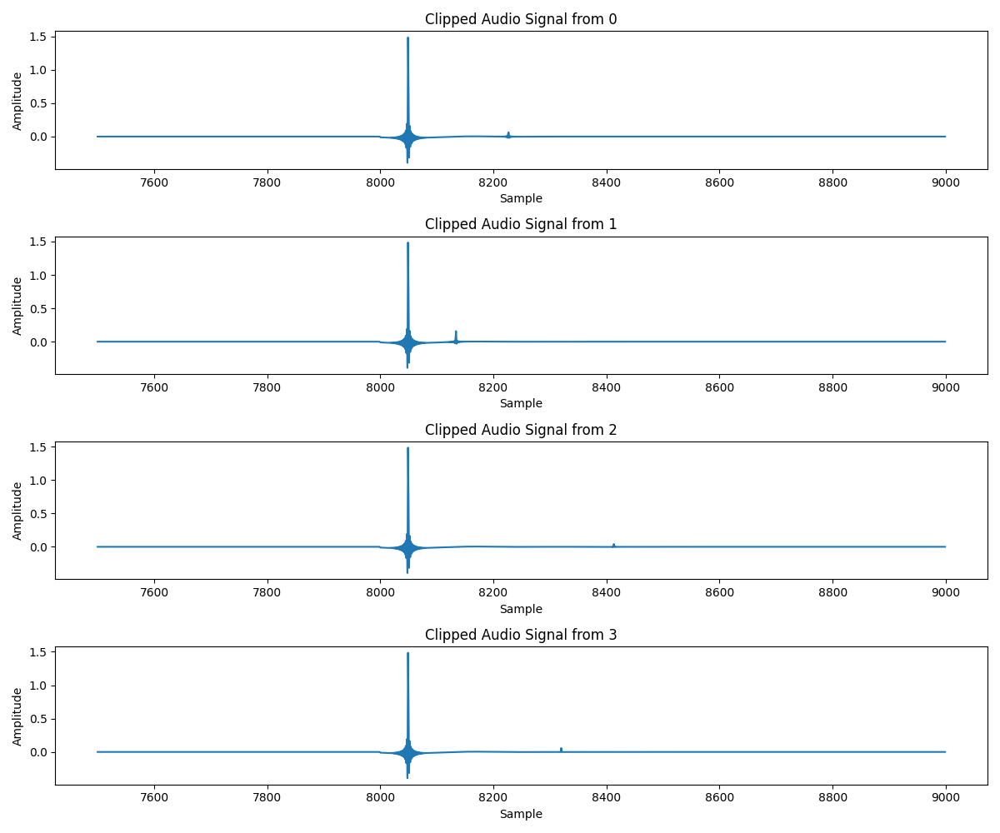

# Proomacoustics Wall Reverberation

## Overview

`PyRoomAcoustics` で壁への反射の設定方法とその影響を確認する

## Contribution

`plot_reverberation_wall` 関数は、壁の吸音率が 1 ではな壁の色を変えて部屋を描画することができます

| 実験番号 | 壁と音源の距離 | 画像 |
| --- | --- | --- |
| 1 | (2, 2) |  |
| 2 | (1, 1) |  |
| 3 | (4, 4) |  |
| 4 | (3, 3) |  |

## Experiment

* 部屋の (0, 0) の座標からインパルス応答を再生
* 同じく (0, 0) に配置されたマイクで反射音を録音
* 壁の距離によって反射音の到来時間が変わることを確認

## Result

